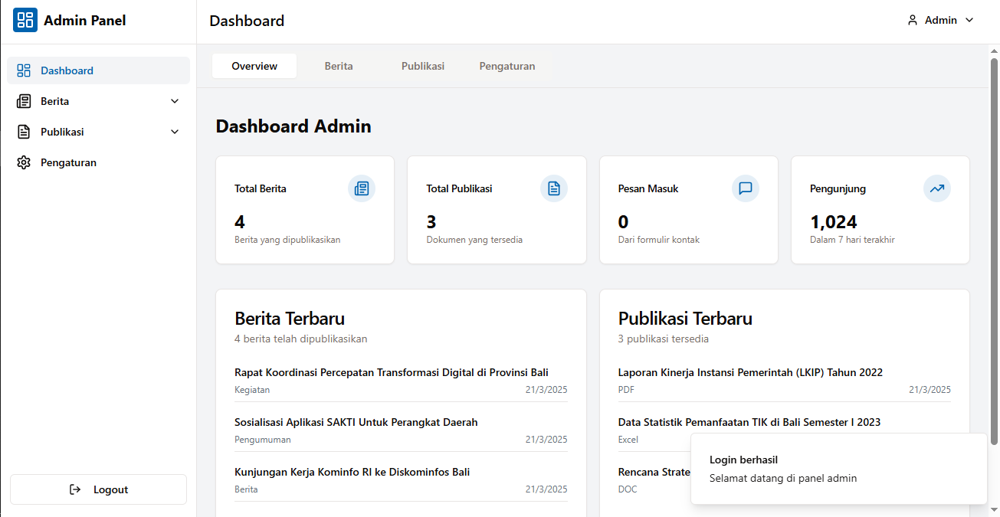

# Website Diskominfos Provinsi Bali

Proyek ini adalah website informasi pemerintah yang terinspirasi dari situs Dinas Komunikasi, Informatika dan Statistik Provinsi Bali. Website ini menyediakan informasi departemen, berita, layanan, dan publikasi pemerintah.

## Tampilan Website




## Fitur

- **Tampilan Modern & Responsif**: Website dirancang dengan tampilan yang menarik dan responsif untuk berbagai perangkat.
- **Hero Slider**: Menampilkan informasi penting dengan animasi dan efek visual menarik.
- **Layanan Utama**: Menampilkan berbagai layanan yang disediakan oleh Diskominfos dalam tata letak yang rapi.
- **Berita & Pengumuman**: Bagian berita menampilkan artikel terbaru dengan kategori dan fitur pencarian.
- **Publikasi & Dokumen**: Akses mudah untuk dokumen, laporan, dan publikasi resmi.
- **Tautan Penting**: Akses cepat ke situs-situs pemerintah terkait.
- **Form Kontak**: Form kontak interaktif dengan validasi dan captcha untuk keamanan.

## Teknologi

Proyek ini dibangun menggunakan:

- **React**: Library JavaScript untuk pengembangan antarmuka pengguna.
- **TypeScript**: Superset JavaScript dengan pengetikan statis.
- **Tailwind CSS**: Framework CSS untuk styling cepat dan responsif.
- **shadcn/ui**: Komponen UI yang dapat digunakan kembali.
- **Express.js**: Framework server-side untuk backend.
- **Drizzle ORM**: ORM untuk interaksi database.
- **React Query**: Library untuk mengelola state dan fetching data.
- **wouter**: Library routing ringan untuk React.

## Struktur Proyek

```
.
├── client/              # Kode frontend
│   ├── src/
│   │   ├── components/  # Komponen UI
│   │   ├── data/        # Data statis
│   │   ├── hooks/       # Custom hooks
│   │   ├── lib/         # Utilitas
│   │   ├── pages/       # Halaman
│   │   └── App.tsx      # Komponen utama
│
├── server/              # Kode backend
│   ├── index.ts         # Entry point server
│   ├── routes.ts        # API routes
│   ├── storage.ts       # Logika penyimpanan data
│   └── vite.ts          # Konfigurasi Vite untuk server
│
└── shared/              # Kode bersama frontend & backend
    └── schema.ts        # Schema database & validasi
```

## Fitur Utama

### Halaman Utama
- Hero slider dengan informasi penting
- Bagian layanan dengan kartu interaktif
- Berita terbaru dan artikel unggulan
- Publikasi dan dokumen resmi
- Tautan penting ke situs terkait
- Bagian kontak

### Halaman Berita
- Daftar berita terbaru
- Filter berdasarkan kategori
- Halaman detail berita

### Halaman Publikasi
- Daftar publikasi dan dokumen
- Unduhan dokumen

### Halaman Kontak
- Form kontak dengan validasi
- Informasi kontak dan lokasi

## Menjalankan Aplikasi

1. Clone repositori
2. Install dependensi dengan menjalankan `npm install`
3. Jalankan aplikasi dengan `npm run dev`
4. Akses aplikasi melalui `http://localhost:5000`

## Perkembangan Mendatang

- Implementasi sistem pencarian
- Integrasi dengan database eksternal untuk berita
- Penambahan dashboard admin untuk manajemen konten
- Optimasi performa dan aksesibilitas
- Dukungan multi-bahasa

---

habizinnia@gmail.com